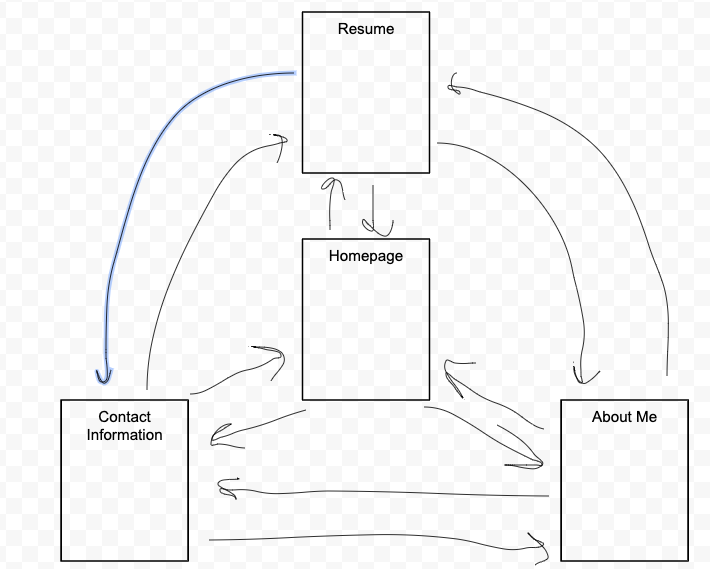
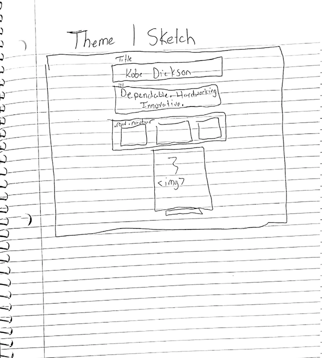
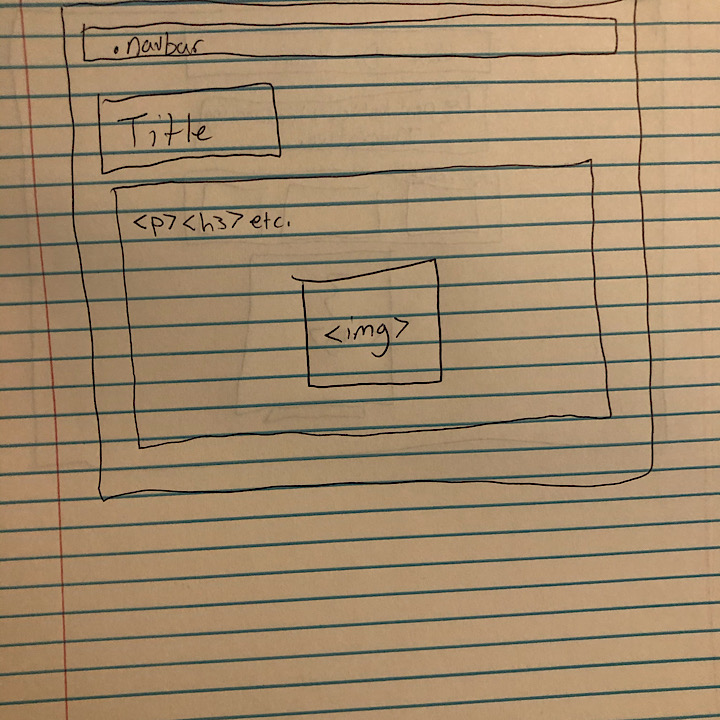

# Project 1: Design Journey

**For each milestone, complete only the sections that are labeled with that milestone.**

Be clear and concise in your writing. Bullets points are encouraged.

**Everything, including images, must be visible in Markdown Preview.** If it's not visible in Markdown Preview, then we won't grade it. We won't give you partial credit either. This is your warning.

## Markdown Instructions

This is a Markdown file. All written documents that you will submit this semester will be Markdown files. Markdown is a commonly used format by developers and bloggers. It's something that you should know. Learning it is a learning outcome of this course.

The following links are Markdown references:
- <https://guides.github.com/features/mastering-markdown/>
- <https://github.com/adam-p/markdown-here/wiki/Markdown-Cheatsheet>

When writing your Markdown file in Atom. Open the command palette and search for **Markdown Preview Plus: Toggle**. This will open up a panel in Atom where you can preview your formatted Markdown file. **The graders will grade you submission in Markdown Preview. All images must be visible in Markdown Preview.**

This is how your insert images into your Markdown documents:

**DELETE THIS SECTION (and example.png) BEFORE THE FINAL SUBMISSION.**

## Audience & Content

**Make the case for your decisions using concepts from class, as well as other design principles, theories, examples, and cases from outside of class.**

You can use bullet points and lists, or full paragraphs, or a combo, whichever is appropriate. The writing should be solid draft quality but doesn't have to be fancy.

**No sketches are required for Milestone 1.**

### Website Topic (Milestone 1)
> Briefly explain what your website will be about.

My website will be a personal website that showcases my work experience and will be about my life.

### Audience (Milestone 1)
> Briefly explain who the intended audience(s) is for your website. Be specific and justify why this audience is appropriate for your site's topic.

The intended audience for my website will be future employers looking for a gritty and hardworking guy. This website will be appropriate for this audience because I will highlight all of my strengths in a format that is easy to use.

### Final Content (Milestone 1)
> Briefly describe the content you plan to include in the final site, and why it's the right content for your audiences.

I will have a blurb about my background, my resume, and pictures of me working and looking professional. I will also look to include a fun facts section as well.

### Home Page Content (Milestone 1)
> Briefly identify what content you will include on the homepage and why this content should be the first thing your target audience sees when they visit your site.

The homepage will have my name and picture along with a couple words that describe me. I will also supply links to other pages. I don't want to flood my audience with information right away so I will keep it short and to the point on my homepage.

## Information Architecture

**Make the case for your decisions using concepts from class, as well as other design principles, theories, examples, and cases from outside of class.**

Each section is probably around 1 reasonably sized paragraph (2-4 sentences).

**No sketches are required for Milestone 2.**

### Audience (Milestone 2)
> A clearer description of audience: who are they, what are they interested in with respect to this site, and what are the design goals for that audience.

My intended audience is hiring managers, especially in the Information Science fields. They will be interested in how I made my own website and how I designed it. My design goals are to have a clean, well-working website that showcases my skills.

### Organization & Navigation (Milestone 2)
> A description of how you generated and considered alternatives for the site's content organization and navigation. You are required to include images here of your card sorting for determining the organization of content and the navigation.

> Thoroughly document this process. The _process_ is the important part of this assignment, not the final result.]

When generating ideas for content, I had to make sure I did not have an overflow of information. I decided that 3 pages beside the homepage would be sufficient. As I was building my website on paper, I noticed that if I had anymore than 3 webpages I would be exhausting them about information about myself.

### Final Organization and Navigation (Milestone 2)
> Explain how the final organization of content and navigation is appropriate for your target audiences.

This organization and navigation is appropriate for my audience because they will be able to access any of the other pages from each individual page. It is also organized so that all options are going to be easy to find as soon as you open the homepage. Hiring managers will not have to sift through a big website to find my information.

## Visual Design

**Make the case for your decisions using concepts from class, as well as other design principles, theories, examples, and cases from outside of class.**

Remember to focus on the things we can't see just by looking at the site: changes, alternatives considered, processes, and justifications.

Each section is probably around 1 reasonably sized paragraph (2-4 sentences).

### Theme Ideas (Milestone 3)
> Discuss several ideas about styling your site's theme. Explain why the theme ideas are appropriate for your target audiences. Feel free to include some hand-drawn sketches (not digital drawings, not mock-ups, not wireframes, etc.) here to document your design process.

I want to center my first page because it only has a a picture of me and links to the pages that people will be looking for. My information within the pages will be left-aligned. I will incorporate soft background colors and utilize sans-serif and one more default font. My target audience will appreciate that because it will show them that I am competent in designing a website that looks great.

### Theme Design (Milestone 3)
> Discuss your theme designs: how did you come to them, what are their strengths and weaknesses, how do they fit your overall design goals and audiences?

> Emotion is a big part of design. What emotions where you thinking about or trying to convey in your designs?

My theme designs came from the activity that we did in class where we had to find sites similar to what we wanted to do for this project. I picked center-alignment for my first page because it is easiest to navigate to other pages. A weakness is that there is a lot of white-space. My other theme design, I included a left-alignment element. This would be the easiest way to convey the information on those pages. The colors are also complementary too and easy on the eyes. I am trying to impress my potential audience.

## Rationale

**This rationale should be polished writing: one you might submit as a report to a client or boss to help explain the project and convince them you did a good job. You'll be surprised how much writing and communicating you need to do about projects and choices on internships and jobs; practice that here.**

It should be a comprehensive, complete story of the project. You might find that each section runs a few paragraphs (1-2). Sketches can often help tell the story of your design. Screenshots are also useful for describing issues discovered during the design process and how you addressed them.

**All images must be visible in Markdown Preview for credit!**

Your rationale should be a polished version of the earlier explanations.

### Site Layout (Final Submission)
> Show your design process and final layout for your site. You must include photos of your sketches of the layout. No digital drawings permitted.

> You must label each figure and provide an explanation of the sketch.

 The first sketch is for my home page. Users will be able to see my name and a picture of me. There are some words that I hope would hook potential employers. There is an image of me playing basketball because in past experience employers have been interested in that. I also added a navigation section in between so the links to my other pages will be easily accessible. I believe that having the navbar in the center of my page will save time instead of making people scroll to the bottom of my page like I was originaly going to do.
 The second sketch is for my three other pages. I was initially going to center all of the content just like the homepage, but it was not pleasing to look at. I went with left align because the audience will be able to digest the content easier. I decided to put the navbar at the top to allow for easy transfer to the other pages.

### Audience (Final Submission)
> A complete and polished description of the intended audience(s) for your website.

The intended audience for this site is potential employers hiring for web design internships. This site would show them that I am competent in html, CSS, and designing. It would also provide them with everything they need to know about me and my work history.

### Design Goals (Final Submission)
> An explanation of the design goals for that audience, based on your earlier rationales.

My design goal is to leverage myself above other potential employees going for the same position as me. I want to showcase my design and CSS skills by showcasing a polished website.

### Navigation (Final Submission)
> An explanation of how the final navigation met your goals and why its appropriate for your audience(s).

The final navigation allows users to access any of the other pages from the site that they are on. This is appropriate for my audience because it would be inefficient for them to have to go back to the home page everytime they wanted to switch to a different page. This helped my goal of showing that I was capable of creating a multi-page website that is easy to navigate.

### Organization (Final Submission)
> An explanation of how the final organization met your goals and why its appropriate for your audience(s).

My final organization met my goals by allowing my user to access anything they might need to know from me. It is also organized in a way that imitates the order of questions they would ask in an interview.

### Visual Design (Final Submission)
> An explanation of how the final design met your goals and why its appropriate for your audience(s).

My visual design was aesthetically pleasing to myself and I feel other users might feel the same way. I used soft colors that does not overwhelm the user and are complementary with eachother.

### Self-Reflection (Final Submission)
> What did you learn from this assignment? What are some of your strengths and weaknesses?

I learned that I am good at writing html and CSS. I found out that my weaknesses are in design and writing about why I did something.
