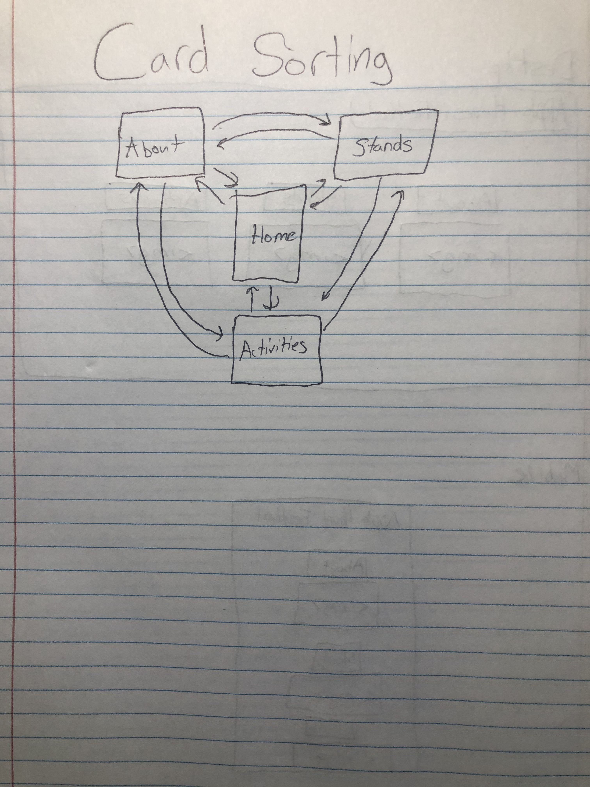
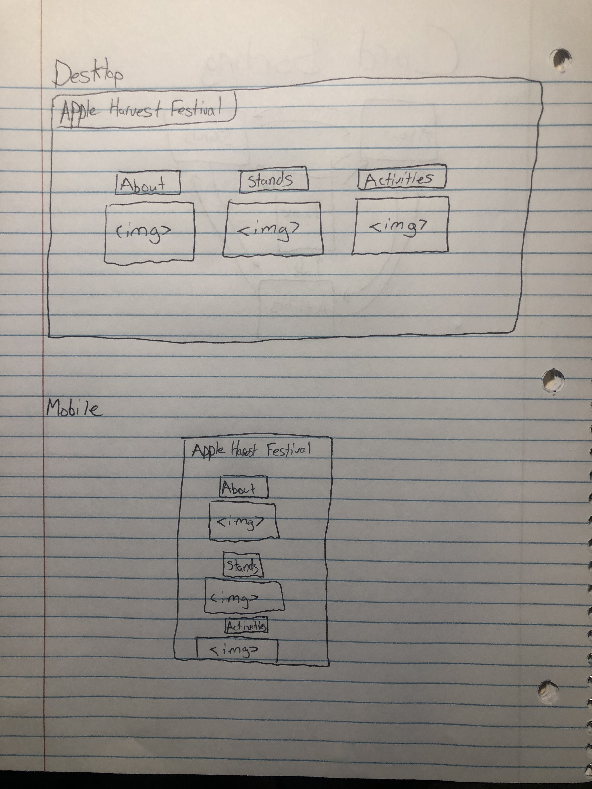

# Project 2: Design Journey

**For each milestone, complete only the sections that are labeled with that milestone.**

Be clear and concise in your writing. Bullets points are encouraged.

**Everything, including images, must be visible in Markdown Preview.** If it's not visible in Markdown Preview, then we won't grade it. We won't give you partial credit either. This is your warning.

## Design Planning

**Make the case for your decisions using concepts from class, as well as other design principles, theories, examples, and cases from outside of class.**

You can use bullet points and lists, or full paragraphs, or a combo, whichever is appropriate. The writing should be solid draft quality but doesn't have to be fancy.

### Audience (Milestone 1)
> Briefly explain who the intended audience(s) is for your website. Be specific and justify why this audience is appropriate for your site. Remember, you may not be the audience.

The intended audience for my site are parents of students and potential visitors that come to Ithaca to visit their friends. This is appropriate because these would be the two groups to not know much about the Apple Harvest Festival in the first place.

### Semi-Structured Interview Questions (Milestone 1)
> Plan your semi-structured interview which you'll use to identify the needs of your users. You are required to have a minimum of 4 questions.

1. Recall your last festival you attended, what was your experience like?
2. What are some similarities shared between festivals you have attended?
3. Tell me what you know about the Apple Harvest Festival.
4. What is the connection between a festival's quality and the kind of stands there?

### Interview Notes (Milestone 1)
> Interview at least 2 people from your audience. Take notes and include those notes here. Make sure to include a brief description of each interviewee.

Interviewee 1: Joe Samberg

TODO: Housemate's dad
TODO: Last festival was a "blast." All his favorite food had great food and entertainment. Knew a little bit from his son talking about it. Said his favorite festivals always have the best food.

Interviewee 2: Chris Nemechek

TODO: Friend from home that plans to visit me next year.
TODO: He described his last festival experience as fantastic. He said that all of the festivals he went to had really great websites that detailed what stands were available and when he would be able to attend. Knew nothing about Apple Harvest Festival. His favorite things at festivals were the food and souvenir stands.

### Needs (Milestone 1)
> Analyze your audience's needs and wants from your notes above. List each need/want below. There is no specific number of needs required for this, but you need enough to do the job.

Need/Want 1: Background: [Brief Title]
- **Needs and Wants** _What does your client and audience need and want?_
  - My audience needs information on what the Apple Harvest Festival is and what it's all about.
- **Design Ideas and Choices** _How will you meet those needs and wants?_
  - I will meet these needs by dedicating a page to talking what Apple Fest is and how it came about.
- **Rationale & Additional Notes** _Justify your decisions; additional notes._
  - N/A

Need/Want 2: List of food stands
My audience seemed to emphasize how important food stands were to them so I will dedicate a page highlighting what selections are available at Apple Harvest Festival.

Need/Want 3: Activities/Entertainment
My audience also said that there were fun activities and great entertainment, so I will make a page highlighting past activities and entertainment available.

### Initial Design (Milestone 1)
> Document your design process. Show us your card sorting. Describe your theme. Show us sketches of your site (mobile and desktop versions). etc. You should show us how your came up with your design and how your iterated on that design; show us the evolution of your design.

For my theme, I am thinking about choosing fall colors. I think a yellowish background with red accents will be reminiscient of fall. I attached my design below. I came up with my design by tring to find something that was visually appealing and easy to access. On both of my sketches all of the links to other pages are right there in front of the potential user.

## Design

### Final Design (Milestone 2)
> Include the final sketches for each of your pages.

**Desktop Design:**

**Mobile Design:**
See above for my mobile designs

### Design Rationale (Milestone 2)
> Explain why your design is appropriate for your audience. Specially, why does your content organization, navigation, and site design/layout meet the needs of your users?

My design is appropriate because it is incorporates everything asked for in my surveying. My content organization is viewable and I give descriptions of what each page holds. Navigation is good because you are able to reach any of the other 3 pages from the page you are currently on. The site design and layout are aesthetically pleasing and does not get in the way of the content I am trying to put forth.

### Responsive Design Considerations (Milestone 2)
> Explain how you adapted your design to be responsive (support both mobile and desktop versions).

My content moves with the screen and my images stay proportionate to the screen. So even on mobile devices you will be able to read and see everything.

### Coded Draft Desktop Website (Milestone 2)
> Include screenshots of the draft version of your desktop design AND your mobile design. Include a screenshot for every page. If you're using Firefox, click the 3 dot button in the address bar and select "Take a Screenshot."

**Desktop Screenshots:**

**Mobile Screenshots:**

## User Testing (Round 1)

### User Testing Plan (Milestone 3)
> Plan out your user testing tasks before doing your user testing. These must be actual user testing tasks. **Tasks are not questions!**

1. Find where the craft show is and what might be there.

2. Identify activities that could be offered at the Apple Harvest Festival.

3. Find the general time of the year when the Apple Harvest Festival occurs.

### User 1 - Testing Notes (Milestone 3)
> When conducting user testing, you should take notes during the test. Place your notes here.

User immediately clicked stands without scrolling down the main page. Found the map and completed task 1. From stands page, the user clicked on activities tab. Read through the page and completed task 2. User went back to home page. Read everything on there. Clicked through other 3 pages reading them all. Could not find any information about when Apple Harvest Festival occurs.

### User 1 (Milestone 3)
> Using your notes from above, describe your user by answering the questions below.

1. Who is your user, e.g., where does the user come from, what is the user's job, characteristics, etc.?

Jake Kuhn-Bethesda, MD-Intern at LemonPerfect-Tall, mild demeanor, obsessed with fashion.

2. Does the user belong to your audience of the site? (Yes / No)
> If “No”, what’s your strategy of associating the user test results to your audience’s needs and wants? How can your re-design choices based on the user tests make a better fit for the audience?

Not fully a part of my audience as he went to Cornell, and is not enrolled at the moment, but would come back for something like Apple Fest. He has an eye for design and his feedback would be very useful in my first steps of re-design.

### User 1 (Milestone 3)
> Report the results of your user's test. You should explain **what the user did**, describe the user's **reaction/feedback** to the design, **reflect on the user's performance**, determine what **re-design choices** you will make **for EACH task**. You can also add any additional comments. See the example design journey for an example of what this would look like.

Task: Find where the craft show is and what might be there.

- **Did you evaluate the desktop or mobile design?**
  - Mobile
- **How did the user do? Did they meet your expectation?**
  - They were a great user. Went straight to the page and found the map. Met all my expectations.
- **User’s reaction / feedback to the design** (e.g., specific problems or issues found in the tasks)
  - The reaction I got was, "Holy smokes this map is tiny."
- **Your reflections about the user’s performance to the task**
  - The User performed the tasks to the best of his ability.
- **Re-design choices**
  - I will add a feature to view the map larger.
- **Additional Notes**
  - I did not take into account people who might be visually impaired so this fix will be better for them.

  Task: Identify activities that could be offered at the Apple Harvest Festival.

  - **Did you evaluate the desktop or mobile design?**
    - Mobile
  - **How did the user do? Did they meet your expectation?**
    - Same as before, completed task easily.
  - **User’s reaction / feedback to the design** (e.g., specific problems or issues found in the tasks)
    - Voiced how much he liked the range of activities listed.
  - **Your reflections about the user’s performance to the task**
    - Performance was well.
  - **Re-design choices**
    - N/A
  - **Additional Notes**
    - N/A

    Task: Find the general time of the year when the Apple Harvest Festival occurs.

    - **Did you evaluate the desktop or mobile design?**
      - Mobile
    - **How did the user do? Did they meet your expectation?**
      - Did not meet my expectations because I thought it would be fairly easy.
    - **User’s reaction / feedback to the design** (e.g., specific problems or issues found in the tasks)
      - User was visbly frustrated when he could not complete this task.
    - **Your reflections about the user’s performance to the task**
      - Not a performance issue. Did everything he could to try and complete task. Mistake was on my part.
    - **Re-design choices**
      - I will put October 2020 in the header so it is easily visible.
    - **Additional Notes**
      - I did not have it anywhere so this is something the site needs.

### User 2 - Testing Notes (Milestone 3)
> When conducting user testing, you should take notes during the test. Place your notes here.

User made sure to read everything on the home page when completing task 1. Clicked on the page for stands after seeing there was a map underneath the header for that section. Saw the map and had to squint to read it. Went to the activities page for task 2. Found activities that might be offered quick. Went to home page to complete task 3. Clicked through every page looking for a date.

### User 2 (Milestone 3)
> Using your notes from above, describe your user by answering the questions below.

1. Who is your user, e.g., where does the user come from, what is the user's job, characteristics, etc.?

Ed Harshany; Pace, FL; Ex-Air Force; seemed nice, had never spoken with him before, but my roomates father so knew he wanted to make it up here to visit.

2. Does the user belong to your audience of the site? (Yes / No)
> If “No”, what’s your strategy of associating the user test results to your audience’s needs and wants? How can your re-design choices based on the user tests make a better fit for the audience?

Yes

### User 2 (Milestone 3)
> Report the results of your user's evaluation. You should explain **what the user did**, describe the user's **reaction/feedback** to the design, **reflect on the user's performance**, determine what **re-design choices** you will make **for EACH task**. You can also add any additional comments. See the example design journey for an example of what this would look like.

Task: Find where the craft show is and what might be there.

- **Did you evaluate the desktop or mobile design?**
  - Desktop
- **How did the user do? Did they meet your expectation?**
  - User did well and met my expectations.
- **User’s reaction / feedback to the design** (e.g., specific problems or issues found in the tasks)
  - Voiced how small the map was and how hard it was to see all of the details.
- **Your reflections about the user’s performance to the task**
  - User's performance was exceptional.
- **Re-design choices**
  - I will put October 2020 in the header so it is easily visible.
- **Additional Notes**
  - I did not have it anywhere on the site so this is something the site needs.

Task: Identify activities that could be offered at the Apple Harvest Festival.
  - **Did you evaluate the desktop or mobile design?**
    - Desktop
  - **How did the user do? Did they meet your expectation?**
    - User did well and met my expectations.
  - **User’s reaction / feedback to the design** (e.g., specific problems or issues found in the tasks)
    - No reactions whatsoever.
  - **Your reflections about the user’s performance to the task**
    - Performance was exceptional again.
  - **Re-design choices**
    - N/A
  - **Additional Notes**
    - N/A

Task: Find the general time of the year when the Apple Harvest Festival occurs.

  - **Did you evaluate the desktop or mobile design?**
    - Desktop
  - **How did the user do? Did they meet your expectation?**
      - User did not meet my expectations on this task. I thought it was a task able to be done quickly.
  - **User’s reaction / feedback to the design** (e.g., specific problems or issues found in the tasks)
      - Was confused as to if I was messing with him or not.
  - **Your reflections about the user’s performance to the task**
      - Gave full effort in performance.
  - **Re-design choices**
     - I will add October 2020 underneath the title.
  - **Additional Notes**
      - Users will need to know when the Apple Harvest Festival is happening.

### Changes Based on User Testing (Milestone 3)
> What changes did you make to your design based on user testing?

I made the image bigger on the stands page and added a date underneath the title.

## User Testing (Round 2)

### Finished Desktop & Mobile Website (Final Submission)
> Include screenshots of both the desktop and mobile version of your site that you will be using for user testing.

**Desktop Screenshots:**

**Mobile Screenshots:**

### User Testing Plan (Final Submission)
> Plan out your user testing tasks before doing your user testing. These must be actual user testing tasks. **Tasks are not questions!**
> These should be the same tasks from round 1.

1. Find where the craft show is and what might be there.

2. Identify activities that could be offered at the Apple Harvest Festival.

3. Find the general time of the year when the Apple Harvest Festival occurs.

### User 3 - Testing Notes (Final Submission)
> When conducting user testing, you should take notes during the test. Place your notes here.

The user scrolled down reading the home page. Saw a map was offered on the stands page and clicked the link. Completed task one by zooming in on map and finding location. User then clicked on activities link and read page to complete task two. User was initially confused on task 3. User said, "Oh I saw this on the home page." Found the date on the homepage to complete task 3.

### User 3 (Final Submission)
> Using your notes from above, describe your user by answering the questions below.

1. Who is your user, e.g., where does the user come from, what is the user's job, characteristics, etc.?

Chris Nemechek-Holcomb, Ks--Carpenter--Simple guy, hardworking, blue-collar. Expressed interests in coming to visit me.

2. Does the user belong to your audience of the site? (Yes / No)
> If “No”, what’s your strategy of associating the user test results to your audience’s needs and wants? How can your re-design choices based on the user tests make a better fit for the audience?

Yes

### User 3 (Final Submission)
> Report the results of your user's test. You should explain **what the user did**, describe the user's **reaction/feedback** to the design, **reflect on the user's performance**, determine what **re-design choices** you will make **for EACH task**. You can also add any additional comments. See the example design journey for an example of what this would look like.

Task: Find where the craft show is and what might be there.

- **Did you evaluate the desktop or mobile design?**
  - Mobile
- **How did the user do? Did they meet your expectation?**
  - User did well met all of my expectations.
- **User’s reaction / feedback to the design** (e.g., specific problems or issues found in the tasks)
  - User was very receptive to design. Did not have any complaints.
- **Your reflections about the user’s performance to the task**
  - Could not have asked for a more cooperative user.
- **Re-design choices**
  - N/A
- **Additional Notes**
  - N/A

  Task: Identify activities that could be offered at the Apple Harvest Festival.
  - **Did you evaluate the desktop or mobile design?**
    - Mobile
  - **How did the user do? Did they meet your expectation?**
    - Again, user met my expectations.
  - **User’s reaction / feedback to the design** (e.g., specific problems or issues found in the tasks)
    - No specific problems or issues.
  - **Your reflections about the user’s performance to the task**
    - Again, very good user in respect to completing tasks.
  - **Re-design choices**
    - N/A
  - **Additional Notes**
    - N/A

  Task: Find the general time of the year when the Apple Harvest Festival occurs.
    - **Did you evaluate the desktop or mobile design?**
      - Mobile
    - **How did the user do? Did they meet your expectation?**
      - User kind of underperformed, but no major hiccups.
    - **User’s reaction / feedback to the design** (e.g., specific problems or issues found in the tasks)
      - User was confused at first but got re-oriented quick.
    - **Your reflections about the user’s performance to the task**
      - Tried hard and still completed the task.
    - **Re-design choices**
      - N/A
    - **Additional Notes**
      - N/A

### User 4 - Testing Notes (Final Submission)
> When conducting user testing, you should take notes during the test. Place your notes here.

User scrolled through the front page reading everything. Then clicked on Stands section. Found map at top of page and located the craftshow and what was offerred successfully. User then went back to the home page and clicked on the activities link. Scrolled through and voiced how fun it would be to have live performances back. Completing the 3rd task, he was able to easily identify October 2020 on the home page.

### User 4 (Final Submission)
> Using your notes from above, describe your user by answering the questions below.

1. Who is your user, e.g., where does the user come from, what is the user's job, characteristics, etc.?

Bill Knapp--Washington D.C.--Political Strategist--Really sharp

2. Does the user belong to your audience of the site? (Yes / No)
> If “No”, what’s your strategy of associating the user test results to your audience’s needs and wants? How can your re-design choices based on the user tests make a better fit for the audience?

Yes

### User 4 (Final Submission)
> Report the results of your user's evaluation. You should explain **what the user did**, describe the user's **reaction/feedback** to the design, **reflect on the user's performance**, determine what **re-design choices** you will make **for EACH task**. You can also add any additional comments. See the example design journey for an example of what this would look like.

Task: Find where the craft show is and what might be there.

- **Did you evaluate the desktop or mobile design?**
  - Desktop
- **How did the user do? Did they meet your expectation?**
  - User met all of my expectations.
- **User’s reaction / feedback to the design** (e.g., specific problems or issues found in the tasks)
  - No problems he voiced to me.
- **Your reflections about the user’s performance to the task**
  - User's performance was exceptional
- **Re-design choices**
  - N/A
- **Additional Notes**
  - N/A

  Task: Identify activities that could be offered at the Apple Harvest Festival.
  - **Did you evaluate the desktop or mobile design?**
    - Desktop
  - **How did the user do? Did they meet your expectation?**
    - User performed well.
  - **User’s reaction / feedback to the design** (e.g., specific problems or issues found in the tasks)
    - No issues
  - **Your reflections about the user’s performance to the task**
    - Completed task efficiently.
  - **Re-design choices**
    - N/A
  - **Additional Notes**
    - N/A

  Task: Find the general time of the year when the Apple Harvest Festival occurs.
    - **Did you evaluate the desktop or mobile design?**
      - Desktop
    - **How did the user do? Did they meet your expectation?**
      - User did not have a problem with this task
    - **User’s reaction / feedback to the design** (e.g., specific problems or issues found in the tasks)
      -No reaction from the user.
    - **Your reflections about the user’s performance to the task**
      - Can not complain about performance.
    - **Re-design choices**
      - N/A
    - **Additional Notes**
      - N/A

### Changes Based on User Testing (Final Submission
> What changes did you make to your design based on user testing?

My two users this round did not provide me with any feedback about changing the design of my site.

## Self-Reflection (Final Submission)
> This was the first project in this class where you were able to follow a user-centered design process from start to finish. What did you learn from this experience?

I learned that users play a big part in developing a website. Users can notice things that a developer would miss. User-centered design helps in making the website as accessible as possible.

> Take some time here to reflect on how much you've learned since you started this class. It's often easy to ignore our own progress. Take a moment and think about your accomplishments in this class. Hopefully you'll recognize that you've accomplished a lot and that you should be very proud of those accomplishments!

I have learned quite a bit since I started this class. Coming in, I knew a bit about html but not a lot. I could barely code a webpage. Now I am making multi-page websites and styling them with CSS. This class has been a blast to be a part of and I can't wait to see what's up next.
