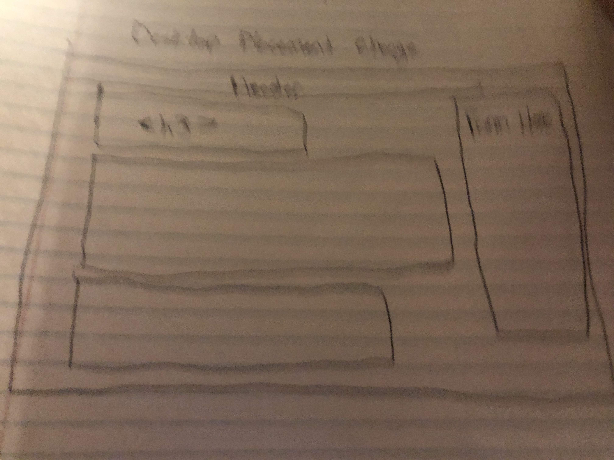
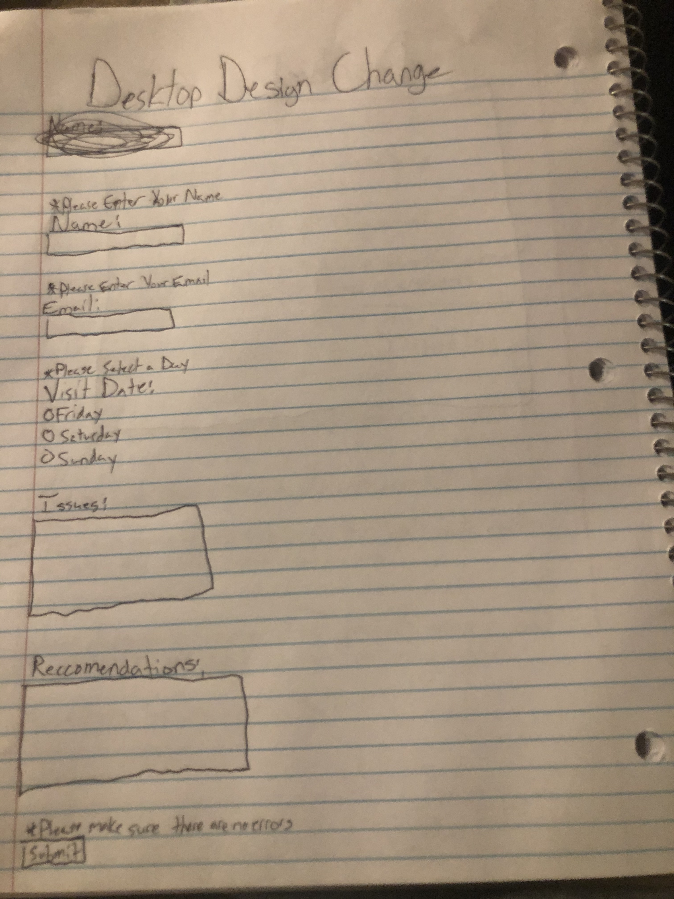
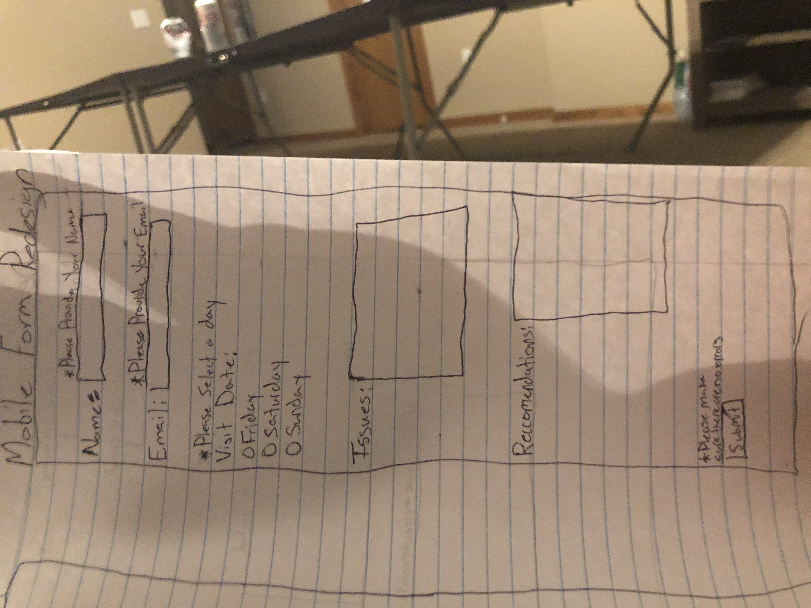

# Project 3: Design Journey

**For milestones, complete only the sections that are labeled with that milestone.**

Be clear and concise in your writing. Bullets points are encouraged.

**Everything, including images, must be visible in Markdown Preview.** If it's not visible in Markdown Preview, then we won't grade it. We won't give you partial credit either.

**Make the case for your decisions using concepts from class, as well as other design principles, theories, examples, and cases from outside of class.**

You can use bullet points and lists, or full paragraphs, or a combination, whichever is appropriate. The writing should be solid draft quality but doesn't have to be fancy.

## Project 1 or Project 2
> Which project will you add a form to?

Project 2


## Audience (Milestone 1)
> Who is your site's target audience? This should be the original audience from Project 1 or Project 2. You may adjust the audience if necessary. Just make sure you explain your rationale for doing so here.

The intended audience for my site are parents of students and potential visitors that come to Ithaca to visit their friends. This is appropriate because these would be the two groups to not know much about the Apple Harvest Festival in the first place. Their feedback via forms would be the most useful


## Audience's Needs (Milestone 1)
> List the audience's needs that you identified in Project 1 or 2. Just list each need. No need to include the "Design Ideas and Choices", etc. You may adjust the needs if necessary. However, any changes you make to the needs for this project should be clearly identified and justified.

- My audience needs information on what the Apple Harvest Festival is and what it's all about.
- List of food stands
- Activities/Entertainment


## HTML Form + User Needs Brainstorming (Milestone 1)
> Using the audience needs you identified, brainstorm possible options for an HTML form for the site. List each idea and provide a brief rationale for how the HTML form addresses that need.

- Feedback-- allows us to find out if the site helped the users while they were visiting applefest.
- Trivia Quiz-- a fun way for users to explore the site and test their knowledge


## HTML Form Proposal & Rationale (Milestone 1)
> Make a decision about your site's form. Describe the purpose of your proposed form for your Project 1 or 2 site. Provide a brief rationale explaining how your proposed form meets the needs of your site's audience.
> Note: If your form is a contact form, we expect to see a thorough justification explaining how a contact form addresses the user's _actual_ needs. In your justification explain how a contact form better suits the needs of your user compared to the alternatives (e.g. sending you an email using your email address).

Form Proposal: Feedback Form

User Needs Rational: This allows me to evaluate my performance in designing the website and make fixes that would better suit the users.


## Form User Data (Milestone 1)
> Think through and plan the data you need to collect from the users. Do you need their name? Email address? etc.

- Name
- Email address
- When the user visited applefest
- Any issues with Applefest you would like to bring up?
- Any reccomendations on how Applefest was advertised you would like to make?


## Form Components & Validation Criteria (Milestone 1)
> For each piece of data you plan to collect from the users, identify an appropriate HTML component to collect that data and decide the validation criteria (e.g. whether this data is _required_). Briefly explain your reasoning for the component choice and the validation criteria.

- Name (required): `<input type="text">` A text box would allow users to easily enter their name. Need their name to be able to thank them for their feedback.
- Email (required): `<input type="email">` The email component would allow the user to enter their email. Email is needed to send the user a thank you email for submitting feedback.
- Visit Date:`<input type="checkbox">` A checkbox will allow the user to select what days they were at applefest. Can't be required because of what was said in lessons.
- Issues (required): `<input type="text">` Need issues to make applefest better for everyone. Would do a larger text box than name so users know that I am looking for feedback.
- Reccomendations (required):`<input type="text">` Need reccomendations to better design our site for users. A similar sized text box as issues would be implemented.
- Submit (required): `<input type="submit">`Need submit in order to validate the form.


## Form Location (Milestone 1)
> Which HTML file will you place your form?

index.html

> Sketch the location of the form in that page. This sketch need not be fancy. You don't need to provide many details of the page or form. Just plan the location of the form on the page and communicate that to us. You can literally have a box that says "FORM HERE."

**Desktop Location**


Change location because I did not like the white space on the right hand side of my page.



**Mobile Location**


## Form Design (Milestone 1)
> Include sketches on your form below. Include sketches of your **mobile and desktop** versions without corrective feedback. Show us the evolution of your design and the alternatives you considered.

**Desktop Sketches**


**Mobile Sketches**


## Form Feedback Design (Milestone 1)
> Include sketches of your **mobile and desktop** with _corrective feedback_. Show us the evolution of your design and the alternatives you considered.

**Desktop Feedback**


I ended up changing my design because after this was coded it did not look aesthetically pleasing.


**Mobile Feedback**


I ended up changing my design because after this was coded it did not look aesthetically pleasing.




## Form Implementation Planning (Milestone 1)
> What submission method will your form use? GET or POST. Explain your reasoning.

I will use POST because I am dealing with some personal info and POST is a more secure method of carrying data.

> For your site's `<form>` element, plan all HTML attributes that you will need and their values. Hint: action=, method=, novalidate

- `method="post"`
- `action="https://www.cs.cornell.edu/courses/cs1300/2020fa/submit.php"`
- `novalidate"`
- `required`


## Additional Information (Milestone 1)
> (optional) Include any additional information, justifications, or comments we should be aware of.

N/A


## Plan Validation Pseudocode (Final Submission)
> Write your form validation pseudocode here.

```
when user clicks submit:

    if name entry is valid
        hide name feedback
    else
        show "Please provide your name"

    if email entry is valid
        hide email feedback
    else
        show "Please provide your email"

    if issues entry is valid
        hide issues feedback
    else
        show "Please provide any issues you had"

    if reccomendations form is valid
        hide reccomendations feedback
    else
        show "Please provide any recommendations you had"

    if form is valid
        send form to server
    else
        show "Please make sure there are no errors"

when user submits form ("On Form Submit Event" snippet):

```


## Additional Design Justifications (Final Submission)
> If you feel like you haven’t fully explained your design choices in the final submission, or you want to explain some functions in your site (e.g., if you feel like you make a special design choice which might not meet the final requirement), you can use the additional design justifications to justify your design choices. Remember, this is place for you to justify your design choices which you haven’t covered in the design journey. Use it wisely. However, you don’t need to fill out this section if you think all design choices have been well explained in the final submission design journey.

Last project, I was deducted because my nav bar switches as you switch pages. I did this so you were able to access each page from the current page you were on. I wanted to clarify my design choice at this opportunity.

I also chose to leave the submit button on the left side of the form. It was not aesthetically pleasing and I had to hunt for it when it was on the bottom right side. Had my form been a full page then that might have been a viable option.

## Self-Reflection (Final Submission)
> This was the first project in this class where you coded some JavaScript. What did you learn from this experience?

I learned that computers are not as smart as I thought they were. I also learned that I must be precise in telling them what to do.


> Reflect on how HTML, CSS, and JavaScript together support client-side interactivity. If it's helpful, you can describe your mental model of client-side interactivity or explain how the general idea of showing and hiding content can be used to implement other forms of client-side interactivity beyond form validation and feedback.

So my mental model of HTML, CSS, and JavaScript working together is like a 3on3 basketball team. They each bring their own components to form a team that works together. These components support client-side interactivity by allowing for developers to tell what a user is doing wrong instead of the user having to figure out what they are doing well. The general idea of showing and hiding content can also be used when a user interacts with other parts of a site. Playing around with JS I found out that I can manipulate text and images to appear and disappear when certain things are clicked.


> Take some time here to reflect on how much you've learned since you started this class. It's often easy to ignore our own progress. Take a moment and think about your accomplishments in this class. Hopefully you'll recognize that you've accomplished a lot and that you should be very proud of those accomplishments!

This class was very fun to take and I really enjoyed it. It probably influenced my career path because I was undecided before but now I could see myself doing this. Thank You!
